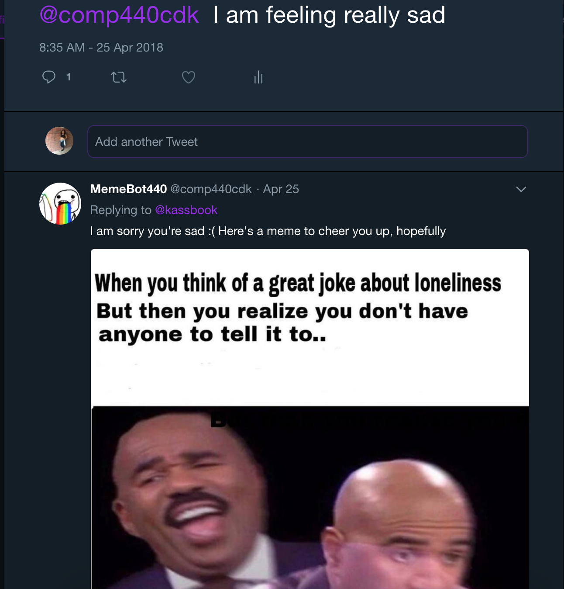
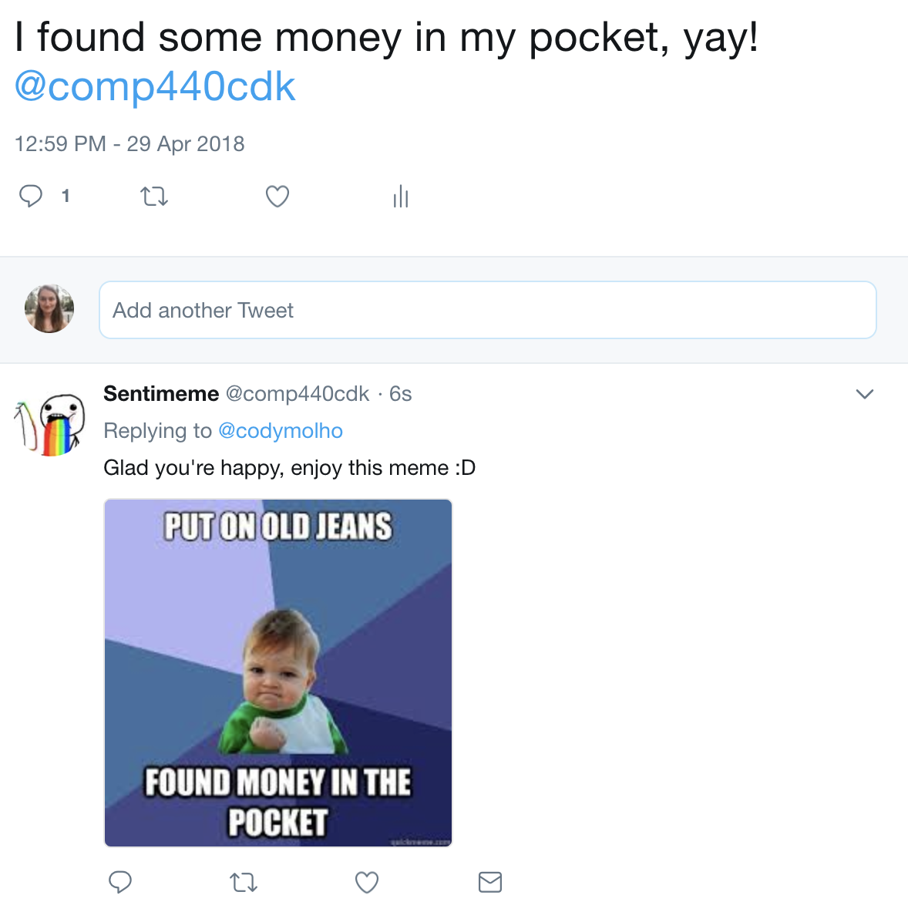

# MemeGenerator

Collective Intelligence Final Project May 2018
 
Cody Molho, Dongmin Park, &  Kassandra Munguia

## Inspiration

After learning abot text sentiment analysis through Tweets, we decided to build on that knowledge and create a memebot generator on Twitter. 

This memebot, @comp440cdk, will be able to reply in real time with an appropriate meme to the users who has tweeted at it. Any user can tweet at @comp440cdk and our program is able to determine whether the sentiment behind the tweet was postive, negative or neutral. Once the feeling is determined, the program chooses a random meme image from the apprpriate image folder and tweets back at the user with the image and a little saying. For example: 

  
 

 
 ## How to run this?
 
In order for the memebot to work, in the terminal, run python bot.py. From there, you can tweet @comp440cdk and it will respond within seconds. You do not need to follow the bot in order to receive a tweet back but you do need to keep the file running! 

## How does this work?

Our program uses a sentiment classifer that determines the sentiment on a -1 to 1 scale. We have determined the intervals for each feeling: -1 to -0.1 Negative, -0.1 to 0.1 Neutral, 0.1 to 1.0 Positve. 

From there, we implement a Word2Vec analysis. We check the distance each word in the tweet has with each tag in the appropriate file. The meme that is chosen is the one with the max distance with the tweet. 

The memes have a csv file in each folder with a string of words that associated with each meme.

  
 

The above meme is about the weekend ending and the tags for this image are: cat, grumpy, Monday, sarcasm, Sunday, work, school. Tags and memes were chosen by us. 

  
 

